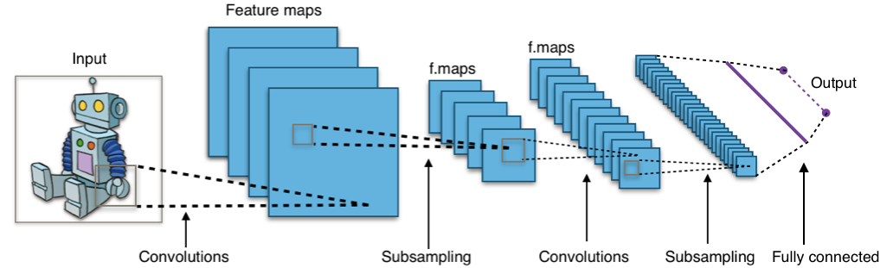
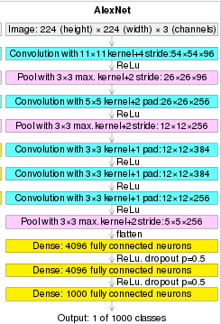
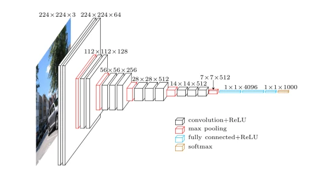

## ITMO Computer Vision Course 2022

---

# Лабораторная работа №3

## **Простые системы классификации изображений на основе сверточных нейронных сетей**

**Цель работы:** 

Научиться создавать простые системы классификации изображений на основе сверточных нейронных сетей.

**Задание:** 

1. Реализовать систему классификации согласно описанию, используя не
   менее трех различных архитектур нейронной сети.
2. Сравнить качество работы, скорость и количество потребляемой памяти
   для каждой архитектуры.
3. Сделать отчёт в виде readme на GitHub, там же должен быть выложен
   исходный код.

**Описание:**

Необходимо реализовать простейшую систему классификации изображений
на основе сверточных нейронных сетей. Возможно использовать любые
доступные технологии, рекомендованный список такой:
• Google Colab для запуска (можно другую платформу или локальную
машину)
• PyTorch
• Torchvision
Система должна загружать изображение с диска, преобразовывать в нужный
для обработки моделью нейронной сети формат (тензор), выполнять
предобработку, если требуется (например, изменение размера и
нормирование), затем обрабатывать с помощью нейронной сети и выводить
результат (номер класса, название, его вероятность для первых 5 наиболее
вероятных классов).Необходимо провести исследование по сравнению эффективности трех
разных архитектур (можно использовать предобученные модели из
torchvision.models https://pytorch.org/vision/stable/models.html, например,
AlexNet, VGG16, ResNet50). Нужно узнать, на каком датасете предобучены
данные модели (использовать веса, полученные с одного и того же набора) и
найти список классов, которые они предсказывают.
Каждую модель необходимо протестировать на вашем собственном наборе
из не менее чем 50 изображений (можно использовать любые изображения,
но не те, которые использовались для обучения), в качестве метрик
использовать top-1 accuracy и top-5 accuracy.
В данной работе не требуется проводить обучение нейронной сети (только
по желанию).

## Теоретическая база

Нейронные сети успешно применяются для различных задач классификации. Не является исключением и классификация изображений, т.е. присвоение входному изображению определенной метки, или класса(одной или нескольких). Однако графическая информация обладает несколькими важными особенностями. Во-первых, изображения предствляют собой крупные многомерные массивы, и если использовать каждый пиксель как вход - сложность и кол-во элементов нейросети будет расти очень быстро. А это, в свою очередь, не только повышает требования к оборудованию для вычислений, но чаще приводит к переобучению сети. Во-вторых, для корректного опознания изображения необходимо оценивать не просто каждый конкретный элемент, а его положение относительно других, топологию. Немаловажным требованием может стать определенная стойкость нейросети к поворотам объекта, изменению освещения и т.п.(иначе инструмент сильно потеряет в универсальности). Все эти факторы сильно затрудняют работу системы при выборе архитектуры по типу полносвязных нейронные сетей прямого распространения с обратным распространением ошибки. Но именно для таких случаев были разработаны т.н. сверточные нейронные сети(далее СНС). 

Суть СНС - в чередовании т.н. сверточных слоев(C-layers), слоев субдискретизации(S-layer), или иначе, pooling layers, и полносвязных слоев(F-layer).  Наглядно это представлено на картинке ниже([Convolutional neural network - Wikipedia](https://en.wikipedia.org/wiki/Convolutional_neural_network)):



С сверточном слое производят последовательно т.н. свертку матрицы входного изображения и некоторого выбраного фильтра(иначе - ядра), который является также небольшой матрицей весов. В процессе свертки мы получает набор т.н. "карт признаков" - матриц меньшей размерности, которые тем не менее, несут информацию о каких-либо особенностях исходного изображения. Т.е. чем больше фрагмент изображния похож на фильтр, тем большие значения будут содержаться в результирующей матрице. В слоях субдискретизирующих слоях производят некоторое усреднее, тем самым уменьшая размерность данных. В конечном счете мы получаем некоторый набор "карт признаков"(фактически просто "признаков"), которые подаются на полносвязанные слои с заданными функциями активации, на выходе из которых мы получаем вероятности принадлежности изображения к тому или иному классу.  

Существует ряд конкретных архитектур СНС, разрабатываемых для тех или иных задач. Далее в работе будут использоваться три варианта СНС: AlexNet, ResNet101 и VGG16. 

###### AlexNet

Разработана  Alex Krizhevsky совместно с  Ilya Sutskever и Geoffrey Hinton. Выиграла  ImageNet Large Scale Visual Recognition Challenge(ImageNet 2012) в сенятбре 2012 и умеет распознавать до 1000 классов изображений и создавалась для использования совместно с GPU.  



(изображение с https://en.wikipedia.org/wiki/AlexNet )

Тренировочный датасет - ImageNet.

##### ResNet101

Базируется на концепциях т.н. остаточной нейронной сети(Residual neural network), что позволяет снизить деградация нейросети при увеличении числа слоев. В ходе работы сеть может "пропускать" определенные слои. Победитель соревнования ImageNet 2015-ого года.

Тренировочный датасет - ImageNet.

##### VGG16

Особенность архитектуры -  использование ядер свертки небольшого размера (3x3, в отличие от больших ядер размера 7x7 или 11x11). Победитель соревнования ImageNet 2013-ого года (VGG-16), набравший точность 92.7%. Пример архитектуры на рисунке ниже([[1409.1556v6] Very Deep Convolutional Networks for Large-Scale Image Recognition](https://arxiv.org/abs/1409.1556v6)): 



## Описание разработанной системы

Программа реализована на языке python в виде google colab - файла, копия находится в репозитории в папке src, онлайн доступ по ссылке [Google Colab](https://colab.research.google.com/drive/1M_P3z_W05sspIBnI8xJnV7nSWhgZ1y9W?usp=sharing). Для создания нейросетей применяются предобученные готовые модели из библиотеки torchvision. Обучение нейросетей проводилось по датасету ImageNet. Списки предсказываемых классов можно скачать по ссылке https://raw.githubusercontent.com/pytorch/hub/master/imagenet_classes.txt .

Для теста брался датасет из 50-ти фотографий лис, собранных случайным образом из интернета. Ссылка - https://db.rzhevskyrobotics.com/s/aszMPeLN2Y4CcQS/download/samples.zip  

Реализованы три модели - для архитектур AlexNet, ResNet101 и VGG16.

Общий алгоритм программы следующий:

1. Подготовка среды - импорт библиотек, скачивание датасета, предобученной модели и списка классов.

2. Подготовка датасета - загрузка изображений в память, их нормализация, формирование массива тезоров 

3. Подготовка предобученной нейросети заданной модели

4. Прогон всех изображений датасета, печать на экран top-5 наиболее вероятных меток и веротностей для каждого изображения, а также формирование общего top-5 для всех изображений датасета.

5. В процессе работы собираются данные по быстродействию и затратам памяти

## Результаты работы и тестирования системы

В целом все модели справились с определением тестовых объектов. 

Сравнение времени исполнения:

|          | AlexNet | ResNet101 | VGG16  |
| -------- | ------- | --------- | ------ |
| Время, с | 2.414   | 30.780    | 24.544 |

Сравнение затраченной памяти(согласно torch.profiler):

|            | AlexNet | ResNet101 | VGG16   |
| ---------- | ------- | --------- | ------- |
| Память, Mb | 92.50   | 3809.28   | 2580.48 |

Основные предсказанные классы(top-5 accuracy):

| Модель    | Классы                                                   |
| --------- | -------------------------------------------------------- |
| AlexNet   | ['red fox', 'kit fox', 'grey fox', 'dhole', 'red wolf']  |
| ResNet101 | ['kit fox', 'grey fox', 'red fox', 'coyote', 'red wolf'] |
| VGG16     | ['kit fox', 'red fox', 'grey fox', 'dhole', 'coyote']    |

Отчеты профайлера:

**AlexNet:**

```bash

----------
---------------------------------  ------------  ------------  ------------  ------------  ------------  ------------  ------------  ------------  
                             Name    Self CPU %      Self CPU   CPU total %     CPU total  CPU time avg       CPU Mem  Self CPU Mem    # of Calls  
---------------------------------  ------------  ------------  ------------  ------------  ------------  ------------  ------------  ------------  
                      aten::empty         0.16%       3.979ms         0.16%       3.979ms       7.235us      92.50 Mb      92.50 Mb           550  
    aten::max_pool2d_with_indices         5.70%     137.599ms         5.70%     137.599ms     917.327us      50.40 Mb      50.40 Mb           150  
                      aten::addmm        41.44%        1.000s        41.54%        1.003s       6.685ms       1.75 Mb       1.75 Mb           150  
                    aten::resize_         0.01%     260.000us         0.01%     260.000us       5.200us       1.34 Mb       1.34 Mb            50  
       aten::_adaptive_avg_pool2d         0.40%       9.703ms         0.41%      10.006ms     200.120us       1.76 Mb     432.00 Kb            50  
                   aten::_softmax         0.05%       1.160ms         0.05%       1.160ms      23.200us     195.31 Kb     195.31 Kb            50  
        aten::adaptive_avg_pool2d         0.05%       1.223ms         0.43%      10.283ms     205.660us       1.76 Mb     180.00 Kb            50  
                       aten::topk         0.07%       1.802ms         0.07%       1.802ms      36.040us       2.93 Kb       2.93 Kb            50  
                     aten::conv2d         0.08%       1.898ms        51.01%        1.231s       4.925ms      92.50 Mb           0 b           250  
                aten::convolution         0.14%       3.422ms        50.93%        1.229s       4.918ms      92.50 Mb           0 b           250  
---------------------------------  ------------  ------------  ------------  ------------  ------------  ------------  ------------  ------------  
Self CPU time total: 2.414s
```

ResNet101:

```bash

----------
---------------------------------  ------------  ------------  ------------  ------------  ------------  ------------  ------------  ------------  
                             Name    Self CPU %      Self CPU   CPU total %     CPU total  CPU time avg       CPU Mem  Self CPU Mem    # of Calls  
---------------------------------  ------------  ------------  ------------  ------------  ------------  ------------  ------------  ------------  
                      aten::empty         0.40%     122.134ms         0.40%     122.134ms       3.193us       3.72 Gb       3.72 Gb         38250  
                    aten::resize_         0.08%      25.254ms         0.08%      25.254ms       7.539us       1.72 Gb       1.72 Gb          3350  
       aten::_slow_conv2d_forward        67.47%       20.767s        67.65%       20.823s       6.216ms       2.33 Gb     620.54 Mb          3350  
    aten::max_pool2d_with_indices         1.10%     338.200ms         1.10%     338.200ms       6.764ms     114.84 Mb     114.84 Mb            50  
                 aten::empty_like         0.08%      24.476ms         0.21%      63.482ms      12.208us       3.02 Gb      28.71 Mb          5200  
                     aten::conv2d         0.52%     158.808ms        94.34%       29.037s       5.584ms       3.02 Gb      21.25 Mb          5200  
     aten::_batch_norm_impl_index         0.24%      75.363ms         2.50%     770.339ms     148.142us       3.02 Gb      16.53 Mb          5200  
                aten::thnn_conv2d         0.15%      47.083ms        67.72%       20.846s       6.223ms       2.33 Gb       2.30 Mb          3350  
                       aten::mean         0.00%       1.372ms         0.02%       6.409ms     128.180us     400.02 Kb     399.88 Kb            50  
                      aten::addmm         0.14%      41.885ms         0.14%      42.366ms     847.320us     195.31 Kb     195.31 Kb            50  
---------------------------------  ------------  ------------  ------------  ------------  ------------  ------------  ------------  ------------  
Self CPU time total: 30.780s
```

VGG16:

```bash

----------
---------------------------------  ------------  ------------  ------------  ------------  ------------  ------------  ------------  ------------  
                             Name    Self CPU %      Self CPU   CPU total %     CPU total  CPU time avg       CPU Mem  Self CPU Mem    # of Calls  
---------------------------------  ------------  ------------  ------------  ------------  ------------  ------------  ------------  ------------  
                      aten::empty         0.13%      32.040ms         0.13%      32.040ms      23.733us       2.52 Gb       2.52 Gb          1350  
    aten::max_pool2d_with_indices         5.81%        1.427s         5.81%        1.427s       5.709ms     875.49 Mb     875.49 Mb           250  
                    aten::resize_         0.00%     598.000us         0.00%     598.000us      11.960us       3.83 Mb       3.83 Mb            50  
                      aten::addmm         8.21%        2.015s         8.22%        2.017s      13.449ms       1.75 Mb       1.75 Mb           150  
       aten::_adaptive_avg_pool2d         0.10%      24.066ms         0.10%      24.713ms     494.260us       4.79 Mb     980.00 Kb            50  
                   aten::_softmax         0.00%       1.101ms         0.00%       1.101ms      22.020us     195.31 Kb     195.31 Kb            50  
        aten::adaptive_avg_pool2d         0.00%     776.000us         0.10%      25.029ms     500.580us       4.79 Mb      98.00 Kb            50  
                       aten::topk         0.01%       1.780ms         0.01%       1.780ms      35.600us       2.93 Kb       2.93 Kb            50  
                     aten::conv2d         0.02%       5.910ms        84.97%       20.856s      32.086ms       2.52 Gb           0 b           650  
                aten::convolution         0.05%      12.052ms        84.95%       20.850s      32.077ms       2.52 Gb           0 b           650  
---------------------------------  ------------  ------------  ------------  ------------  ------------  ------------  ------------  ------------  
Self CPU time total: 24.544s
```

## Выводы по работе

В ходе выполнения работы были разработаны простые системы классификации изображений на основе сверточных нейронных сетей различной архитектуры - AlexNеt, ResNet101 и VGG16. Системы были испытаны на датасете, состоящим из 50 изображений лисиц. Все модели корректно предсказали большую часть изображений. Выявлено, что нейросеть AlexNet показывает самую высокую скорость распознавания изображений и потребляет меньше памяти в работе, на втором месте VGG16 и самой ресурсоемкой стала архитектура ResNet101.

## Использованные источники

1. https://towardsdatascience.com/using-convolutional-neural-network-for-image-classification-5997bfd0ede4

2. [Convolutional neural network - Wikipedia](https://en.wikipedia.org/wiki/Convolutional_neural_network)

3. [Применение нейросетей в распознавании изображений / Хабр](https://habr.com/ru/post/74326/)

4. [AlexNet - Wikipedia](https://en.wikipedia.org/wiki/AlexNet)

5. https://viso.ai/deep-learning/vgg-very-deep-convolutional-networks/

6. https://viso.ai/deep-learning/resnet-residual-neural-network/

7. [Сверточные нейронные сети — Викиконспекты](https://neerc.ifmo.ru/wiki/index.php?title=%D0%A1%D0%B2%D0%B5%D1%80%D1%82%D0%BE%D1%87%D0%BD%D1%8B%D0%B5_%D0%BD%D0%B5%D0%B9%D1%80%D0%BE%D0%BD%D0%BD%D1%8B%D0%B5_%D1%81%D0%B5%D1%82%D0%B8) 

8. https://pytorch.org/hub/pytorch_vision_alexnet/ 
